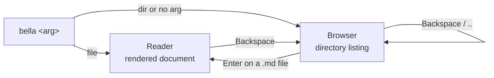

# Capability Catalogue

**What bella can do, and how you make it do it.** One line per capability, grouped by how you
reach it. If you want the internal call chain behind a gesture, that is
[`features.md`](features.md); if you want the module map, that is [`modules.md`](modules.md).

This page is derived from source — the `clap` definition in
[`crates/bella/src/main.rs`](../crates/bella/src/main.rs), the `Action` enum and key mappers in
[`crates/bella/src/events.rs`](../crates/bella/src/events.rs), and the `pulldown-cmark` event
handlers in [`crates/bella-engine/src/markdown.rs`](../crates/bella-engine/src/markdown.rs). It is
not derived from the other docs. Where the two disagreed, source won — see
[Not wired up](#not-wired-up) for what that turned up.

## Quickstart

Run these in a shell:

```bash
cargo build --release                 # build
./target/release/bella README.md      # open one file  → reader mode
./target/release/bella docs/          # open a folder   → browser mode
./target/release/bella                # no arg = browse the current directory
```

Press `q` or `Ctrl-C` to quit from either mode. That is the whole CLI — bella takes **one optional
positional argument and no flags** (beyond `--help` / `--version`, which clap supplies).

| Argument | What you get |
|---|---|
| a file path | **Reader mode** — the rendered document |
| a directory path | **Browser mode** — a listing of that directory |
| nothing | **Browser mode** at the current working directory |

Anything that is not a directory is read as a file; a read failure exits with `cannot read <path>`.

## The two modes

Bella has exactly two screens, and every keybinding belongs to one of them.



In sentences: a file argument starts you in **Reader**; a directory or no argument starts you in
**Browser**. From Browser, `Enter` on a markdown file opens it in Reader. From Reader, `Backspace`
returns to Browser at the directory and cursor position you left. `Enter` and `Backspace` on
directories move you around inside Browser without changing mode. **Search** is a sub-mode of
Reader, not a third screen — it captures typing while active and hands control back on `Enter` or
`Esc`.

## Reading a document

Everything you can do once a file is open.

| Capability | How to invoke |
|---|---|
| Scroll by line | `j` / `k`, `↓` / `↑`, or the mouse wheel (3 lines per tick) |
| Scroll by half page | `Ctrl-d` / `Ctrl-u` |
| Scroll by full page | `PageDown` / `PageUp` |
| Jump to top / bottom | `g` / `G`, or `Home` / `End` |
| Search within the document | `/`, type the query, `Enter` to commit; `Esc` cancels |
| Cycle search matches | `n` / `N` after committing a search |
| Focus links by keyboard | `Tab` / `Shift-Tab`; the view scrolls to keep the focused link visible |
| Follow the focused link | `Enter` |
| Follow a link by mouse | Click it; hovering highlights it first |
| Go back / forward through visited files | `[` / `]` |
| Toggle the table-of-contents rail | `t` — a heading outline pane on the left; auto-hides if the terminal is too narrow to fit both it and a usable body |
| Navigate the TOC rail by keyboard | `T` to focus it, then `j`/`k`/arrows to move, `Enter` to jump, `Esc` to return focus to the body |
| Jump to a heading by mouse | Click it in the TOC rail |
| Clear link focus or cancel a search | `Esc` |
| Return to the file browser | `Backspace` |
| Quit | `q` or `Ctrl-C` |

### Where a link takes you

Link destinations are classified by
[`links::resolve`](../crates/bella-engine/src/links.rs) into four kinds, and each is followed
differently:

| Kind | Example | What happens |
|---|---|---|
| External URL | `https://example.com` | Opens in your **system browser**, not in bella |
| Local file | `./other.md` | Loads and renders in place; the position you left is pushed to history |
| In-document anchor | `#section-title` | Scrolls to that heading — **no history entry** |
| File + anchor | `./other.md#intro` | Loads the file, then scrolls to the anchor |

## Browsing a directory

The browser lists only what bella can open, so it is a short list, not a file manager.

| Capability | How to invoke |
|---|---|
| Move the cursor | `j` / `k`, `↓` / `↑` — wraps around at both ends |
| Open a file or descend into a directory | `Enter`, or click the row |
| Go to the parent directory | `Backspace`, or select the `..` row |
| Scroll the listing | Mouse wheel |
| Quit | `q` or `Ctrl-C` |

Listings contain three entry kinds only — the `..` parent row, subdirectories, and `.md`/`.mdx`
files (`BrowserEntryKind` in [`browser.rs`](../crates/bella-engine/src/browser.rs)). Other file
types are not listed and cannot be opened.

## Selecting and copying text

| Capability | How to invoke |
|---|---|
| Select a range | Click and drag; releasing copies to the system clipboard |
| Select one word | Double-click within 450 ms at the same position; copies immediately |
| Toggle a task-list checkbox | Click it |

Two things to know. **Selection and checkbox toggles never touch the file on disk** — bella
performs no writes at all outside its own tests, so a toggled checkbox is a display change that is
lost on the next file load. And clipboard writes go through `arboard`, so on a headless Linux box
with no display server the copy fails; the error appears in the status line for one frame and
everything else keeps working.

## Markdown bella renders

Parsing runs `pulldown-cmark` with `ENABLE_TABLES`, `ENABLE_STRIKETHROUGH`, `ENABLE_TASKLISTS`,
`ENABLE_FOOTNOTES`, `ENABLE_SMART_PUNCTUATION` and `ENABLE_WIKILINKS` — those flags are the
capability list, and everything below follows from them.

| Construct | Notes |
|---|---|
| Headings | Levels 1–6; each gets a slug so `#anchor` links resolve to it |
| Paragraphs, hard and soft breaks | Word-wrapped to the terminal width |
| Emphasis, strong, strikethrough | Strikethrough needs the `~~text~~` form |
| Inline code and fenced code blocks | Fences are syntax-highlighted — see below |
| Blockquotes | |
| Ordered and unordered lists | Ordered lists honour a custom start number |
| Task lists | Rendered as clickable checkboxes |
| Tables | Column alignment is honoured; cells are click-mapped |
| Footnotes | Definitions and references |
| Horizontal rules | |
| Links, including wikilinks | `[[wikilink]]` syntax is accepted |
| Smart punctuation | Straight quotes and dashes are converted |

Two deliberate non-behaviours, both worth knowing before you file a bug:

- **Raw HTML is dropped.** `Event::Html` and `Event::InlineHtml` are matched and discarded, so an
  HTML block in your markdown renders as nothing at all.
- **Images are not displayed.** An image renders as a muted `[image: path]` text placeholder. The
  engine does collect resolved image paths into `Rendered.images`, but nothing consumes them.

**OKF frontmatter is stripped, not rendered.** A leading `---`-fenced frontmatter block is detected
and removed before the markdown pipeline sees it (`frontmatter.rs`, re-exported as
`Rendered.frontmatter`), so it no longer shows up as a spurious horizontal rule. The reader
recognizes four value shapes (bare/quoted scalar, inline array, block list) and keeps anything else
as raw text rather than erroring. Nothing in the shipped binary displays the parsed frontmatter yet
— that is metadata-pane work, still unwired (see "Not wired up" below).

### Syntax highlighting

Code fences are highlighted by `syntect` using its bundled default syntax and theme sets
([`syntax.rs`](../crates/bella-engine/src/syntax.rs)). Language selection falls back in three
steps: the fence's language token, then a first-line content sniff, then plain text. You do not
configure this — there is no setting for the highlighting theme.

## Colour

| Capability | How it is decided |
|---|---|
| Colour depth (truecolor vs. 256-colour) | **Probed from the environment** — `COLORTERM`, then `TERM_PROGRAM`, then `TERM`. RGB colours are downgraded to the nearest xterm-256 entry when truecolor is not detected. |
| Palette (light vs. dark) | **Not decided — the app hard-codes the dark palette.** See below. |

Set `COLORTERM=truecolor` if your emulator supports truecolor but does not advertise it.

## Not wired up

These exist in `bella-engine` and are covered by tests, but **no code path in the shipped binary
reaches them**. They are listed here because the other docs described several of them as working
features, which was wrong.

| Capability | State in source |
|---|---|
| Light/dark theme selection | `theme::resolve()` and `detect_terminal_theme()` (the `COLORFGBG` probe) exist and are tested. **Neither has a call site.** Every construction site in `app.rs`, `render_worker.rs` and the tests calls `Theme::dark()` directly, so bella is dark-only today regardless of your terminal. |
| The config file | `md_config::load()` reads `theme`, `width` and `line_numbers` from `<config-dir>/md/config.toml`. **It has no call site**, so the file is never read and none of the three keys do anything. |
| A third theme | `Theme::mission_control()` is defined alongside `light()` and `dark()`, but `resolve()` cannot return it — no name maps to it. |
| Line-number gutter | `geometry.rs` supports a gutter, but every caller passes `line_numbers: false` — including the literal `false, // line_numbers` at `app.rs:735`. |
| Editing | `render_with_edit` takes an `Option<EditCtx>`; the app always passes `None`. There is no edit keybinding and no code path that writes a file. |
| Table expansion | The same entry point takes a `TableExpansions` map; the app always passes `TableExpansions::new()` (empty). |
| Frontmatter metadata pane | `Rendered.frontmatter: Option<Frontmatter>` carries the parsed key/value entries; nothing in `bella` (the TUI) reads the field yet. |

**Where the config file would live if it were wired:** `md_config::load()` uses
`dirs::config_dir()`, which is platform-dependent — `~/Library/Application Support/md/config.toml`
on macOS and `~/.config/md/config.toml` on Linux. Earlier docs stated the Linux path
unconditionally.

## See also

- [`features.md`](features.md) — the same gestures with the internal call chain behind each
- [`architecture.md`](architecture.md) — two-crate split, render pipeline, async render worker
- [`modules.md`](modules.md) — per-module purpose, key types, public functions
- [`development.md`](development.md) — build, test, lint, and how to add a keybinding
- `planning/decisions/D3-bella-engine-shared-with-bastion.md` — why the engine's public surface is
  a cross-repo contract
